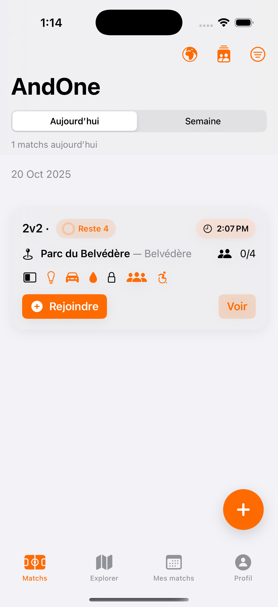
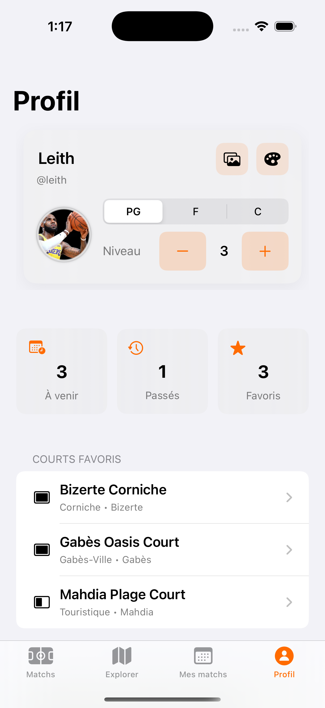
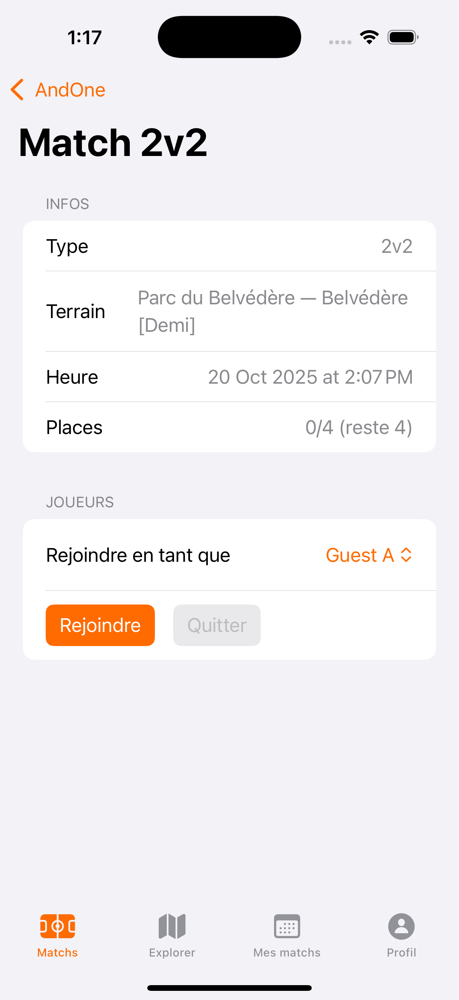
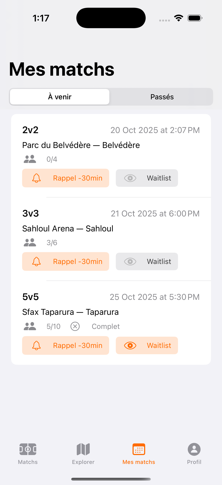
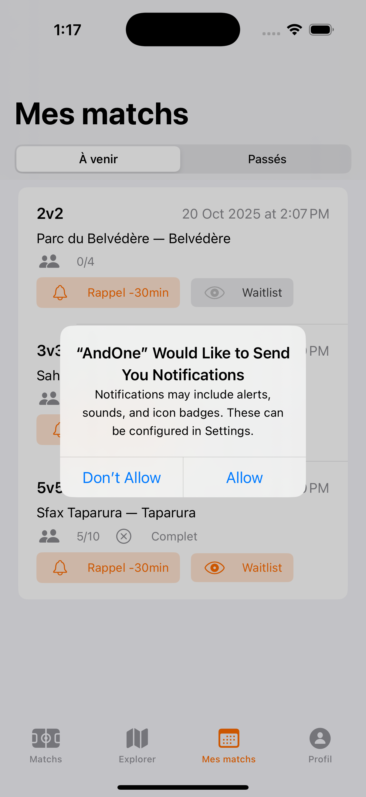

<h1 align="center">AndOne — Street Basketball Matches (iOS)</h1>

  <em>SwiftUI + SwiftData, offline-first. Crée / explore des matchs de basket de rue, gère tes favoris, et pilote ton profil – sans backend.</em>

<!-- INTRO -->
<h2>🎯 Objectif</h2>

AndOne est une app iOS pour les amateurs de <strong>street basketball</strong>. 
Elle permet de <strong>réserver ou créer des matchs</strong> (1v1 → 5v5) sur des <strong>terrains publics</strong>, 
de <strong>rejoindre/quit­ter</strong> un match en temps réel (local), 
et de <strong>suivre ses favoris</strong> – le tout <strong>hors-ligne</strong> via <strong>SwiftData</strong>.

<!-- FEATURES -->
<h2>✨ Fonctionnalités</h2>
<ul>
  <li>
    <strong>Explorer les terrains</strong>
    <ul>
      <li>Filtre par <em>gouvernorat</em> (24 régions tunisiennes) et par <em>type</em> (Demi / Complet).</li>
      <li>Vue <em>Explorer</em> avec icônes d’équipements (éclairage, parking, eau, etc.).</li>
      <li>Marque-page <strong>Favori</strong> ⭐ dynamique (remplissage/couleur live).</li>
    </ul>
  </li>
  <li>
    <strong>Matchs</strong>
    <ul>
      <li>Création de matchs <code>1v1</code>, <code>2v2</code>, <code>3v3</code>, <code>4v4</code>, <code>5v5</code>.</li>
      <li>Règles de capacité et de terrain :
        <ul>
          <li><code>1v1</code> &amp; <code>2v2</code> → <em>demi-terrain</em></li>
          <li><code>3v3</code> → demi <em>ou</em> terrain complet</li>
          <li><code>4v4</code> &amp; <code>5v5</code> → <em>terrain complet</em></li>
        </ul>
      </li>
      <li>Rejoindre / Quitter (un seul join possible par joueur), calcul <strong>spots restants</strong>.</li>
      <li>Cartes de matchs soignées : titre <code>3v3 · Reste 2</code>, heure en chip, compte joueurs, badges d’équipements.</li>
      <li>Menu contextuel rapide sur une carte : <em>Rejoindre</em>, <em>Ajouter/Retirer favori</em>, etc.</li>
    </ul>
  </li>
  <li>
    <strong>Game Details</strong>
    <ul>
      <li>Sections <em>Infos</em> (type, terrain, heure, places) et <em>Joueurs</em>.</li>
      <li>Layout alternatif “demi-terrain” possible (placement visuel des joueurs sur le schéma).</li>
    </ul>
  </li>
  <li>
    <strong>Profil joueur</strong>
    <ul>
      <li>Pseudo (édition in-place), <strong>photo</strong> via <em>PhotosPicker</em>.</li>
      <li>Position <strong>PG/F/C</strong> (segmented) et <strong>niveau</strong> 1–5 (−/+).</li>
      <li>Stats rapides : matchs à venir, passés, favoris.</li>
      <li>Section <em>Administration</em> : Dashboard + Réinitialisation des données de démo.</li>
    </ul>
  </li>
  <li>
    <strong>Admin</strong>
    <ul>
      <li>Ajout de terrains (nom, ville, gouvernorat, type, nombre de paniers, équipements).</li>
      <li>Ajout de joueurs (pseudo, niveau).</li>
    </ul>
  </li>
  <li>
    <strong>Polish & UX</strong>
    <ul>
      <li>Haptics, CTA visibles, filtres sticky, FAB pour créer un match.</li>
      <li>Thème tokenisé (<code>.andOrange</code>, <code>.andInk</code>, <code>.andMuted</code>).</li>
      <li>Accessibilité : Dynamic Type, labels VoiceOver explicites.</li>
    </ul>
  </li>
</ul>

<!-- STACK -->
<h2>🧱 Stack technique</h2>
<ul>
  <li><strong>iOS 17+</strong>, <strong>Swift 5.9+</strong></li>
  <li><strong>SwiftUI</strong> (UI déclarative) + <strong>SwiftData</strong> (persistance locale)</li>
  <li>Architecture par <strong>dossiers MVVM</strong> (Models / Services / ViewModels / Views)</li>
  <li><strong>SF Symbols</strong> pour l’iconographie</li>
  <li>Aucune dépendance externe</li>
</ul>

<!-- STRUCTURE -->
<h2>📁 Structure</h2>
<pre><code>AndOne/
├─ Models/
│  ├─ Court.swift            // Court + governorate, kind, amenities
│  ├─ Game.swift             // Match, capacité, spotsLeft
│  ├─ Player.swift           // Joueur (nickname, level, position PG/F/C)
│  └─ Enums.swift            // GameKind, CourtKind, Governorate, …
│
├─ Services/
│  ├─ BootstrapService.swift // Seed de démo (courts, joueurs, matchs)
│  ├─ FavoritesService.swift // Gestion favoris (Set&lt;UUID&gt;)
│  ├─ LocationService.swift  // Placeholder
│  ├─ NotificationService.swift // Placeholder
│  ├─ AnalyticsService.swift // Placeholder
│  ├─ WaitlistService.swift  // Placeholder
│  └─ HapticsService.swift   // Retour haptique
│
├─ ViewModels/
│  ├─ GameViewModel.swift
│  └─ AdminViewModel.swift
│
├─ Views/
│  ├─ Components/
│  │  ├─ MatchCard.swift
│  │  ├─ AmenityBadge.swift
│  │  ├─ Pill.swift
│  │  ├─ EmptyStateView.swift
│  │  └─ Theme.swift          // .andOrange / .andInk / .andMuted
│  ├─ Home/
│  │  └─ HomeView.swift
│  ├─ Explorer/
│  │  └─ ExplorerView.swift   // Star favoris dynamique
│  ├─ Game/
│  │  ├─ CreateGameView.swift
│  │  ├─ GameDetailView.swift
│  │  └─ MyMatchesView.swift
│  ├─ Admin/
│  │  └─ AdminDashboardView.swift
│  └─ Profile/
│     ├─ ProfileView.swift
│     └─ MainTabView.swift
│
└─ AndOneApp.swift
</code></pre>

<!-- DATA MODEL -->
<h2>🗃️ Modèles (SwiftData)</h2>
<ul>
  <li><strong>Court</strong> : <code>id</code>, <code>name</code>, <code>city</code>, <code>governorate</code>, <code>kind</code> (half/full), <code>hoops</code>, <code>amenities</code> (lighting/parking/water…)</li>
  <li><strong>Player</strong> : <code>id</code>, <code>nickname</code>, <code>position</code> (PG/F/C), <code>level</code></li>
  <li><strong>Game</strong> : <code>id</code>, <code>kind</code> (1v1…5v5), <code>court</code>, <code>scheduledAt</code>, <code>players[]</code>, <em>spotsLeft</em> (calculé)</li>
</ul>

<!-- RUN -->
<h2>🚀 Lancer le projet</h2>
<ol>
  <li>Cloner&nbsp;: <code>git clone https://github.com/&lt;you&gt;/AndOne.git</code></li>
  <li>Ouvrir dans <strong>Xcode 15+</strong>, cibler un simulateur ou un appareil <strong>iOS 17+</strong>.</li>
  <li>Run ▶️. Au premier lancement, <code>BootstrapService</code> injecte des données de démo.</li>
</ol>

  <strong>Re-seed de la démo</strong> : <em>Profil → Administration → « Réinitialiser données de démo »</em>.

<!-- DESIGN -->
<h2>🎨 Design &amp; accessibilité</h2>
<ul>
  <li><strong>Tokens</strong> : <code>.andOrange</code> (accent/CTA), <code>.andInk</code> (texte), <code>.andMuted</code> (métadonnées).</li>
  <li><strong>Cartes</strong> : coins 16–20, ombre douce (y:4–6), densité maîtrisée.</li>
  <li><strong>Badges</strong> : icônes monochromes (fond neutre), orange réservé aux actions.</li>
  <li><strong>Dynamic Type</strong> &amp; VoiceOver : libellés complets (ex. « Match 3v3, reste 2 places, Cité Olympique, 18h »).</li>
</ul>

<!-- ROADMAP -->
<h2>🧭 Roadmap</h2>
<ul>
  <li>Sync Cloud (CloudKit/Supabase) + Auth.</li>
  <li>Push notifications (rappel des matchs, liste d’attente).</li>
  <li>Carte MapKit des terrains + navigation.</li>
  <li>Notes/ratings après match, “playstyle” (Shooter, Slasher, 3&amp;D…).</li>
  <li>Deep links &amp; QR (profil, rejoindre un match direct).</li>
  <li>Localisation AR/EN.</li>
</ul>

<!-- SCREENSHOTS -->
<h2>📸 Screenshots</h2>

Les captures sont disponibles dans <code>./Screenshots/</code>. Aperçu :

  
  
  
   
  
  
  

